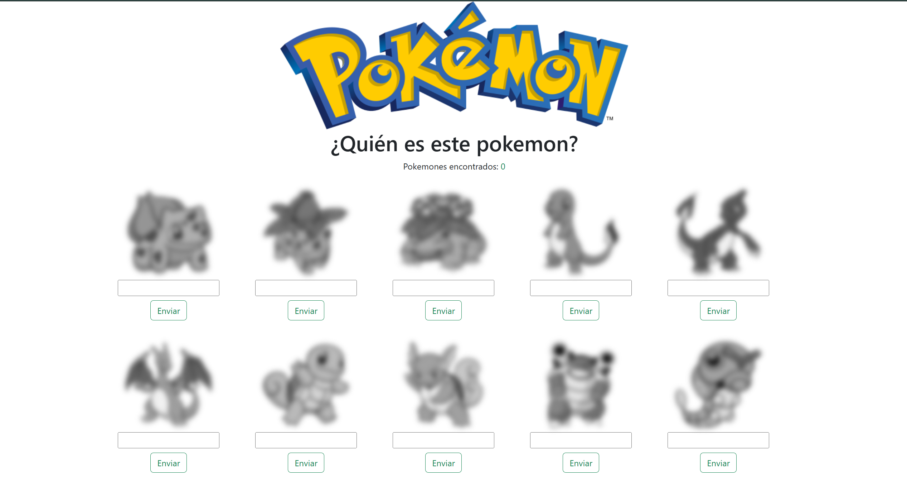

# PokeAPI Vue



Una aplicación construida con **Vue.js** que consume datos de la [PokeAPI](https://pokeapi.co/) para mostrar información sobre Pokémon.


## 🛠️ Tecnologías utilizadas

- [Vue.js 3](https://vuejs.org/)
- [Axios](https://axios-http.com/) para llamadas HTTP
- [Vue Router](https://router.vuejs.org/) para navegación
- CSS / Bootstrap

## 📦 Instalación

1. Clona el repositorio:

   ```bash
   git clone https://github.com/MainEstres/poke-api-vue.git
   cd poke-api-vue

## 2.Instala las dependencias:

```sh 
npm install
```

## 3. Ejecuta el servidor de desarrollo:

```sh
npm run dev
```
